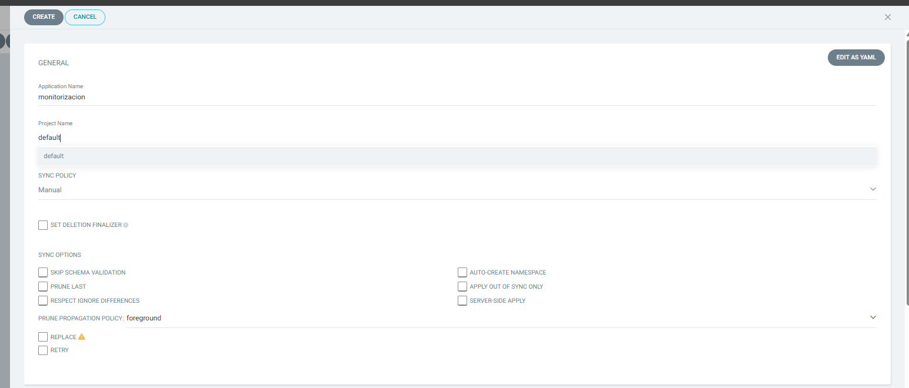
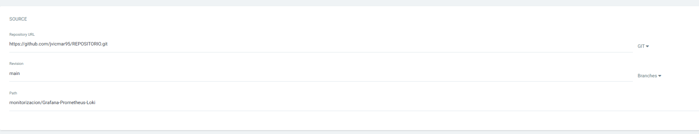
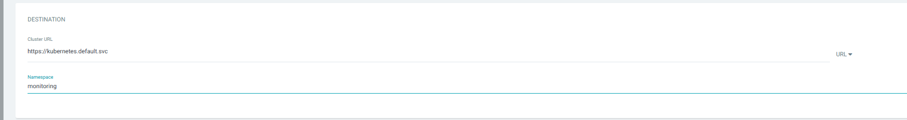
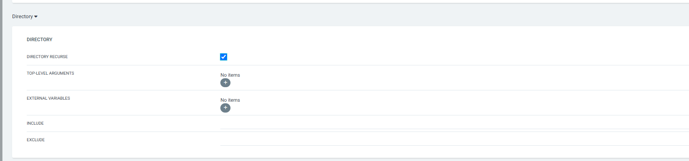
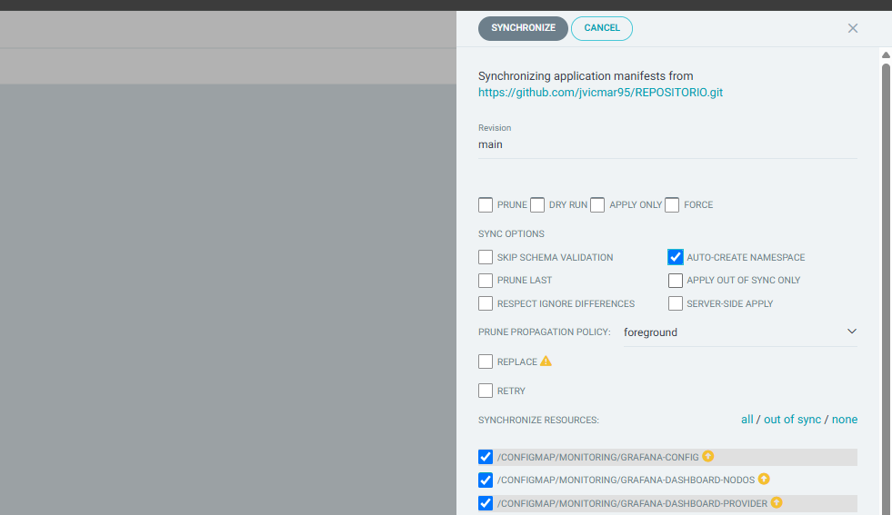

# 📊 Stack de Monitorización: Grafana, Prometheus, Loki

Este entorno despliega un stack completo de observabilidad sobre Kubernetes utilizando manifiestos YAML gestionados por Argo CD. Incluye:

- ✅ **Prometheus** para métricas.
- ✅ **Grafana** para visualización.
- ✅ **Loki + Promtail** para logs.
- ✅ **Dashboards auto-provisionados** mediante ConfigMaps.

---

## 📁 Estructura

---

## 🖼️ Vista previa del stack

### 🔸 General

### 🔸 Source

### 🔸 Destination

### 🔸 Directory

### 🔸 Sync

---

## 🚀 Despliegue con Argo CD

Asegúrate de tener Argo CD apuntando a este path:

